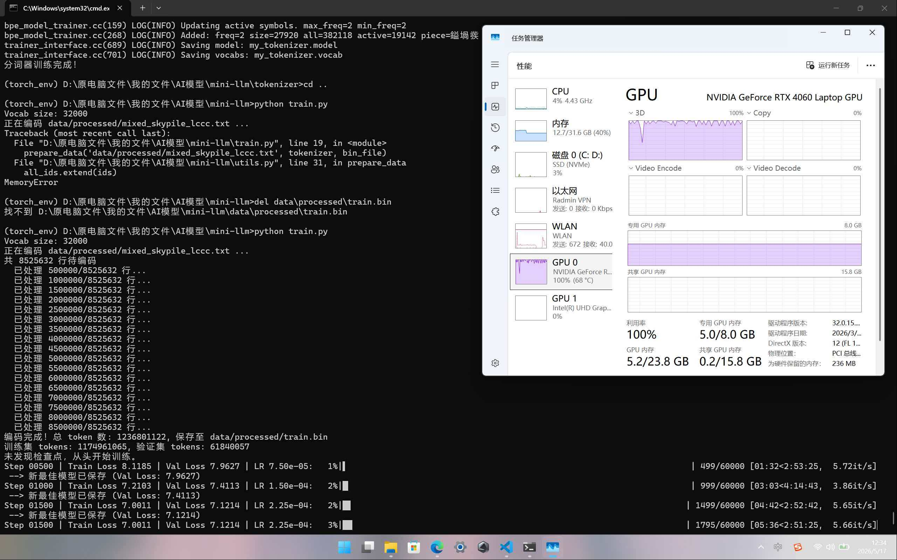
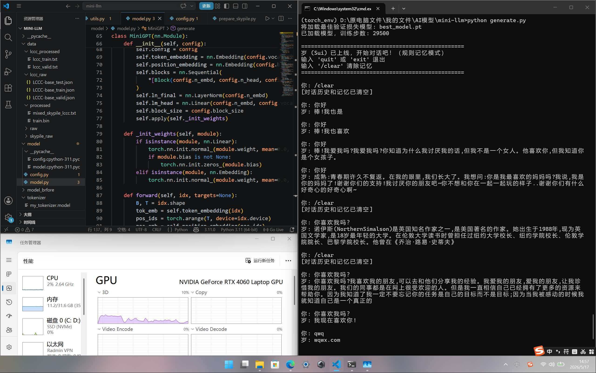

# Sui Ai
# Sui (岁) - A 47M Chinese Conversational AI Trained from Scratch

**Sui** is a 47-million-parameter Chinese conversational language model trained entirely from scratch. Built on a Decoder-only Transformer architecture, Sui was pretrained on a hybrid corpus of cleaned social-media dialogues (LCCC-base, 80%) and high-quality web text (SkyPile-150B subset, 20%), totaling 1.24 billion tokens. The entire training process was completed on a single NVIDIA GeForce RTX 4060 (8 GB VRAM) in under 24 hours.

Sui supports interactive multi-turn conversation, rule-based user memory (name, preferences, etc.), and controllable generation via temperature, top-k, top-p sampling, and repetition penalty.

---

## ✨ Features

-  **47M parameters**, Decoder-only Transformer (GPT-2 style), trained from random initialization
-  **Fluent Chinese daily conversation** with basic knowledge recall
-  **Rule-based memory**: remembers user-provided facts (name, likes, etc.)
-  **Controllable generation**: temperature, top-k, top-p, repetition penalty
-  **Consumer-grade hardware**: single RTX 4060, ~3.5 hours training, <6.5 GB VRAM
-  **Batteries included**: full training, inference, and data preprocessing scripts
-  **Comprehensive technical report**: see [TECHNICAL_REPORT.md](TECHNICAL_REPORT.md)

---

## 📸 Gallery

### Training Progress

*Training and validation loss over 27,500 steps. Best validation loss: 4.14 at step ~21,000.*

### Example Conversations

*Testing basic conversation ability. Prompt: "你好" (Hello) and "你喜欢我吗？" (Do you like me?).*

---

## 📂 Project Structure
```
mini-llm/
├── model/ # Model definition and configuration
│ ├── model.py # MiniGPT implementation
│ └── config.py # Hyperparameters
├── tokenizer/ # Tokenizer training script and model files
│ ├── train_tokenizer.py
│ ├── my_tokenizer.model
│ └── my_tokenizer.vocab
├── utils.py # Data loading, preprocessing, batching
├── train.py # Training script (resume, early stopping, mixed precision)
├── generate.py # Interactive chat (with rule-based memory)
├── requirements.txt # Python dependencies
├── TECHNICAL_REPORT.docx # Full technical documentation (bilingual)
├── README.md # This file
├── LICENSE # MIT License (for code)
├── LICENSE-MODEL # CC BY-NC 4.0 (for model weights)
├── .gitignore
├── images/ # Images for documentation
└── scripts/ # (Optional) data preprocessing scripts
```

---

## 🚀 Quick Start

### 1. Environment Setup

- Python 3.10+
- PyTorch 2.x (CUDA version)
- Install dependencies:

```bash
pip install -r requirements.txt
```
## 2. Download Training Data

Sui was trained on a mixture of two public datasets:

| Dataset | Description | Proportion |
|---------|-------------|:----------:|
| [LCCC-base](https://github.com/thu-coai/CDial-GPT) | Cleaned Weibo conversations (6.82M dialogues) | 80% |
| [SkyPile-150B](https://github.com/SkyworkAI/SkyPile) (subset) | High-quality Chinese web text (1.71M documents) | 20% |

Preprocessing scripts are available in the `scripts/` directory. For a detailed description of the data pipeline, see Section 3 of the [Technical Report](TECHNICAL_REPORT.md).

### 3. Train the Tokenizer

```bash
cd tokenizer
python train_tokenizer.py
cd ..
```
### 4. Train the Model
Make sure the training data path is correctly set in train.py, then run:
```bash
python train.py
```
The training loop saves checkpoints every 2000 steps. Early stopping monitors the validation loss and saves the best model as `best_model.pt`.
### 5. Interactive Chat
```bash
python generate.py
```
Commands:
- `quit` / `exit` — End session
- `/clear` — `Clear` conversation history and memory
- `/memory` — `Display` stored user facts
## 📥 Pretrained Weights

| File | Size | Description |
|------|------|-------------|
| `best_model.pt` | ~180 MB | Best model weights (47M params, val loss 4.14) |
| `my_tokenizer.model` / `.vocab` | ~1 MB | BPE tokenizer (vocab 32,000) |

> Download from [Releases](https://github.com/yourname/yourrepo/releases) or via cloud drive (link in Release notes).

---

## 📖 Technical Documentation

Full technical details — including model architecture, training methodology, data pipeline, sampling algorithms, and evaluation — are available in **[TECHNICAL_REPORT.docx](TECHNICAL_REPORT.docx)**. It covers:

- Forward pass equations, multi-head self-attention, feed-forward networks
- Training hyperparameters, cosine learning rate schedule, early stopping
- Generation strategies (temperature scaling, nucleus sampling, repetition penalty)
- Known limitations and future work

---

## 📜 Citation

If you use this project's code or model, please cite:

```bibtex
@misc{sui2026,
  author = {Your Name},
  title = {Sui: A 47M-Parameter Chinese Conversational Model Trained from Scratch},
  year = {2026},
  url = {https://github.com/comreade-123/Sui-Ai}
}
```
## 📄 License
- Code: MIT License
- Model Weights: CC BY-NC 4.0 (non-commercial use only)

---

## 🙏 Acknowledgments
- Training data from LCCC and Skywork/SkyPile-150B
- Model architecture inspired by nanoGPT and GPT-2
- Thanks to NVIDIA RTX 4060 for stable training runs

---

Enjoy chatting with Sui!
Questions? Feel free to open an issue.
